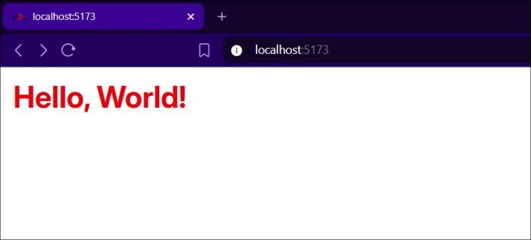

<!--

---
title: >
  Build for the Web: 001 — Hello World App with TypeScript, Node.js & React
  Router v7
subtitle: PRACTICAL MODERN WEB PROGRAMMING FOR TOTAL BEGINNERS
description: >
  Learn how to set up a TypeScript + Node.js project using React Router v7
  Framework Mode. Perfect for beginners looking to build their first web app.
slug: 'build-for-the-web-001-hello-world-app'
series: 'Build for the Web'
tutorialNumber: 1
date: 2025-10-13
author: 'Peter Olum'
tags:
  - TypeScript
  - React
  - Tailwind CSS
  - React Router v7 Framework Mode
  - Node.js
  - Modern Web Development
readingTime: '8 min'
published: true
---

-->

<h1>Build for the Web: 001 — Hello World App with TypeScript, Node.js & React Router v7</h1>

<h3><i>PRACTICAL MODERN WEB PROGRAMMING FOR TOTAL BEGINNERS</i></h3>



---

<h2>Table of Contents</h2>

- [💡 Guide Emojis](#-guide-emojis)
- [🧭 Introduction](#-introduction)
- [🎯 What You'll Build](#-what-youll-build)
- [🛠 Setup Coding Environment](#-setup-coding-environment)

---

## 💡 Guide Emojis

- 👉 means it's your turn to **take action** in VS Code, the terminal, or the
  web browser.
- 👀 means **pause and observe** what appears on your screen.
- ✏️ means **edit or replace** code in a file.
- 🗑️ means **delete** files, folders, or lines of code you no longer need.
- ⚙️ means **configure** or **update project settings** such as `tsconfig.json`
  or `vite.config.ts`.
- 🎯 means **preview the goal or final output** you're working toward in this
  tutorial.
- 🚀 means **you’ve reached a new milestone** — time to move to the next step or
  section.

---

## 🧭 Introduction

- In this tutorial, you'll learn how to **build your first Hello World App**
  with **TypeScript** & **Node.js** using a **React Router v7 Framework Mode**.
- We'll keep it **hands-on** and **beginner-friendly**, so by the end, you'll be
  confident **building a web page, understanding the project structure, and
  previewing your app in the browser**.
- This tutorial is the perfect starting point if you want to **learn modern web
  development using TypeScript** while using a **scaffolded React Router
  project** to simplify setup.

---

## 🎯 What You'll Build

- By the end of this **tutorial**, you'll have a simple web app that shows a red
  **"Hello, World!"** message styled with **Tailwind CSS** and running on
  **React Router v7**.


- You'll **build** this from **scratch** using:
  - **TypeScript** for type-safe code.
  - **React Router v7** for app structure.
  - **Tailwind CSS** for styling.

---

## 🛠 Setting Up Your Coding Environment

- In this **tutorial**, you'll use **Visual Studio Code (VS Code)** with an
  **integrated Bash terminal** as your **IDE**.
- Make sure you have **VS Code** and **Git Bash** installed on your computer
  before proceeding.
- 👉 If you already have **VS Code** installed, open it and run the following
  command in the terminal to check whether **Node.js** is installed:

```bash
node -v
```

- 👀 You should see an output like this if Node.js is installed:

```bash
v23.11.0
```

- 👀 If you see an error such as:

```bash
node: command not found
```

It means **Node.js isn't installed** on your computer.

- 👉 To fix it:
  1. Visit [nodejs.org ↗](nodejs.org).
  2. Download the **LTS (Long-Term Support)** version for your operating system
     — it’s the most stable option for beginners.
  3. Run the installer and follow the setup steps.
  4. After installation, open a **new terminal** and run `node -v` to verify
     Node.js is installed. 👀 You should see a version number like v23.11.0.

- 🎯 Once you see the version number, you're ready to continue!

- 👉 To stay organized, go to your desktop and create a new folder called
  **TypeScript Projects**.
- To do this:
  1. Right-click on your desktop.
  2. Select **New > Folder**.
  3. Name the folder **TypeScript Projects**.

- Then, open the **TypeScript Projects** folder in **VS Code** by:
  1. Open **Visual Studio Code**.
  2. Click on **File > Open Folder…** from the top menu.
  3. Navigate to your desktop and select the **TypeScript Projects** folder.
  4. Click **Select Folder** (Windows) or **Open** (Mac).

- You can also use the shortcut **Ctrl+K, Ctrl+O** (Windows/Linux) or **Cmd+K,
  Cmd+O** (Mac) to open a folder quickly.

- The **TypeScript Projects** folder is where you'll **build** your first
  **Hello World App** with **TypeScript** using a **React Router v7 Framework
  Mode**.

🚀 Now that your environment is ready, let's move on to creating your first real
project.

- Since most real-world apps start from a scaffold, we'll use the **React Router
  v7 Framework Mode** template — it comes with **TypeScript** and **Tailwind
  CSS** already set up.
- _React Router Framework Mode gives you a ready-to-use setup with file-based
  routing, hot reloading, and a built-in development server. Perfect for
  beginners learning modern web apps._
- 👉 Run the following command in your terminal to **scaffold a new React Router
  v7 Framework Mode project** in a folder named **001-hello-world-app**:

```bash
npx create-react-router@latest 001-hello-world-app
```

- 👀 The installation may take a while depending on your **internet speed**.
- 👀 Once the installation completes, you should see a new folder named
  **001-hello-world-app**, and output in the terminal indicating that the
  project has been successfully created.

- 💡 **Tip:** If you ever see errors about missing dependencies after
  scaffolding, run the following command inside your project folder to install
  them:

```bash
npm install
```

- 👀 This ensures all necessary packages are installed before running your
  development server.

- 👉 Navigate to the **001-hello-world-app** folder with this command:

```bash
cd 001-hello-world-app
```

- Inside your **001-hello-world-app** project folder, you'll notice an **app**
  directory — this is where your **routes**, **layouts**, and **components**
  live.

- Let's start the development server to preview the app in the browser.
- 👀 Changes you make to your code now will automatically update in the browser
  thanks to hot reloading.
- 👉 Run the following command in your terminal:

```bash
npm run dev
```

- 👉 Once the server starts, open your browser and go to http://localhost:5173.
- 👀 You should now see the default React Router welcome page — this confirms
  your environment is set up correctly.

🚀 With your development server running successfully, let's now clean up the
default scaffold so we can start fresh.

- ✏️ Replace the code in `app/routes/home.tsx` with the following React code:

```tsx
export default function Home() {
	return (
		<>
			<h1>Hello, World!</h1>
		</>
	)
}
```

- 🗑️ Delete the **welcome** folder and all its contents, since we're no longer
  using it.

- ✏️ Replace the code in **app/app.css** with:

```css
/* app/app.css */
@import 'tailwindcss';

@theme {
	--font-sans:
		'Inter', ui-sans-serif, system-ui, sans-serif, 'Apple Color Emoji',
		'Segoe UI Emoji', 'Segoe UI Symbol', 'Noto Color Emoji';
}

@layer base {
	html,
	body {
		font-family: var(--font-sans);
	}
}
```

- ⚙ Update your **tsconfig.json** to prevent deprecation warnings:

```diff
{
  "include": ["**/*","**/.server/**/*","**/.client/**/*", ".react-router/types/**/*"],
  "compilerOptions": {
    "lib": ["DOM", "DOM.Iterable", "ES2022"],
    "types": ["node", "vite/client"],
    "target": "ES2022",
    "module": "ES2022",
    "moduleResolution": "bundler",
    "jsx": "react-jsx",
    "rootDirs": [".", "./.react-router/types"],
    "baseUrl": ".",
    "paths": {"~/*": ["./app/*"]},
    "esModuleInterop": true,
    "verbatimModuleSyntax": true,
    "noEmit": true,
    "resolveJsonModule": true,
    "skipLibCheck": true,
    "strict": true,
+   "ignoreDeprecations": "6.0"
  }
}
```

- 👉 To verify Tailwind CSS, update `<h1>` in **app/routes/home.tsx**:

```diff
export default function Home() {
  return (
    <>
-     <h1>Hello, World!</h1>
+     <h1 className='text-4xl font-bold text-red-600 m-4'>Hello, World!</h1>
    </>
  )
}
```

- 👀 You should now see a **large red "Hello, World!"** heading in your browser.
- 🚀 Congratulations! You’ve built your first TypeScript + React Router app.

---
